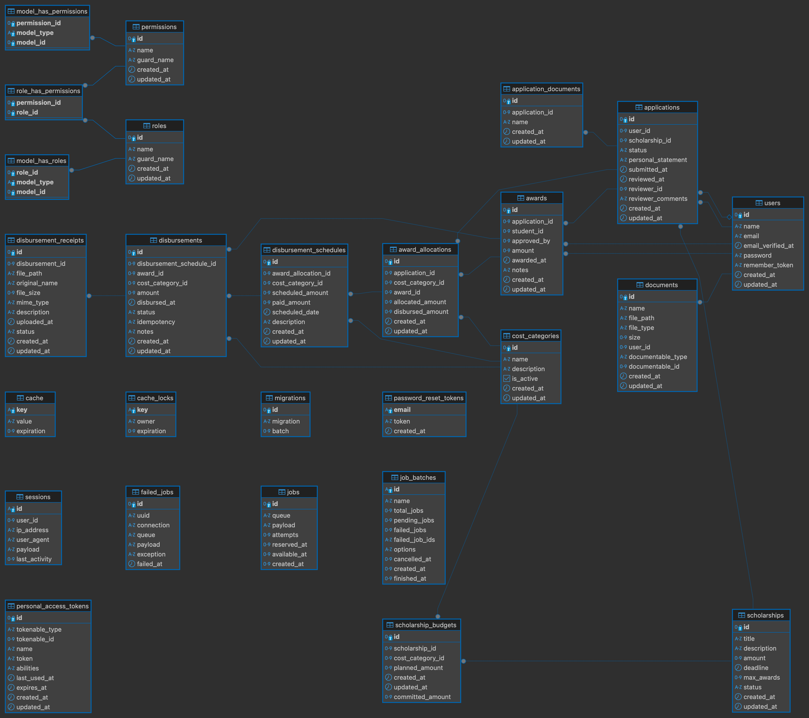

# Scholarship Management API

A Laravel-based RESTful API for managing scholarship programs.

## Setup Instructions

### Prerequisites
- PHP >= 8.2
- PostgreSQL
- Composer

### Installation

1. **Clone the repository** and navigate to the project directory
   ```bash
   cd /path/to/scholarships
   ```

2. **Install PHP dependencies**
   ```bash
   composer install
   ```

3. **Environment configuration**
   ```bash
   cp .env.example .env
   ```
   
   Update the following in your `.env` file:
   ```env
   DB_CONNECTION=pgsql
   DB_HOST=127.0.0.1
   DB_PORT=5432
   DB_DATABASE=scholarships
   DB_USERNAME=your_username
   DB_PASSWORD=your_password
   ```

5. **Generate application key**
   ```bash
   php artisan key:generate
   ```

6. **Run database migrations**
   ```bash
   php artisan migrate
   ```

7. **Seed the database**
   ```bash
   php artisan db:seed
   ```

8. **Create storage link**
   ```bash
   php artisan storage:link
   ```

### Running the Application

This starts:
- Laravel development server (port 8000)
- Queue worker
- Log viewer (pail)

**Individual services**
```bash
# API server only
php artisan serve

# Queue worker
php artisan queue:listen --tries=1

```

## Entity Relationship Diagram (ERD)



The ERD shows the complete database schema including:
- User roles and permissions (Spatie Laravel Permission)
- Scholarship and budget management
- Application and document handling
- Award allocation and disbursement tracking

## Financial Assumptions

### Currency
- All monetary values use **USD** as the base currency
- No multi-currency support implemented

### Precision and Rounding
- **Decimal precision**: 2 decimal places for all amounts
- **Database storage**: `decimal(12,2)` for major amounts, `decimal(10,2)` for smaller amounts

## API Documentation

### Authentication
Uses Laravel Sanctum for API token authentication.

### Base URL
```
http://localhost:8000/api
```

### Main Endpoints
- `POST /login` - User authentication
- `GET /scholarships` - List scholarships
- `POST /scholarships` - Create scholarship (Admin)
- `GET /scholarships/{id}/budgets` - View budgets (Admin)
- `POST /scholarships/{id}/budgets` - Set budgets (Admin)
- `POST /awards` - Create award (Admin)
- `POST /disbursements/pay` - Process payment (Admin)
- `GET /reports/disbursements` - Financial reports (Admin)

### Roles & Permissions
- **Admin**: 
- **Student**: Limited to own applications and awards